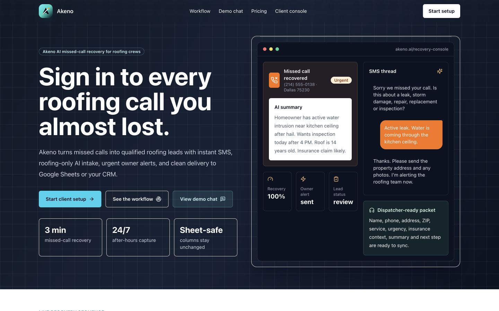
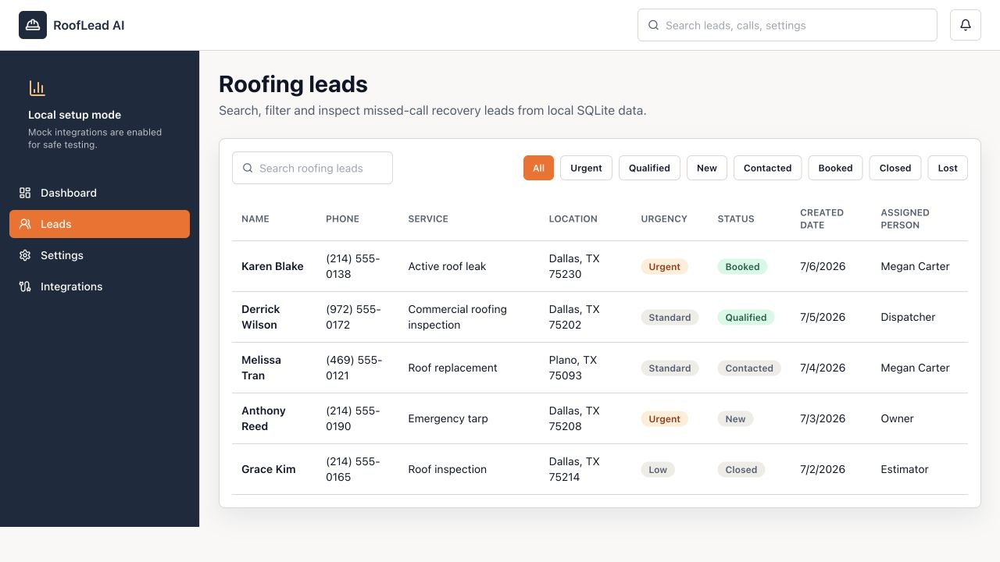
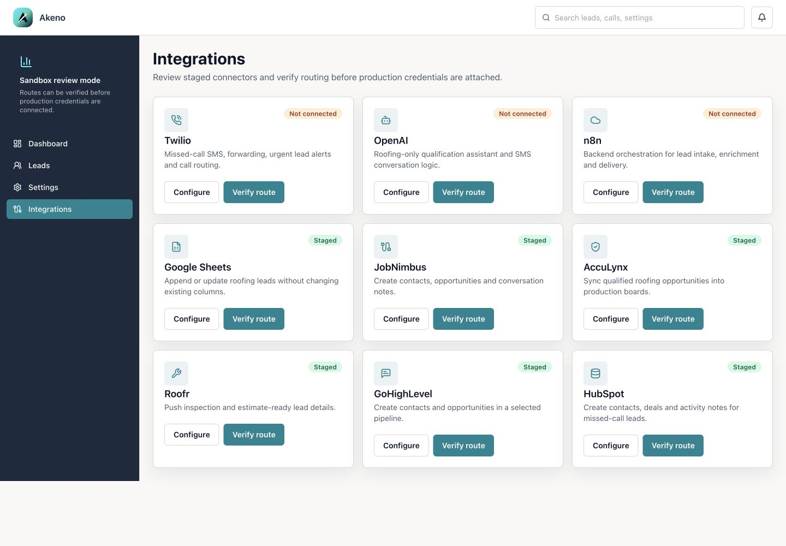
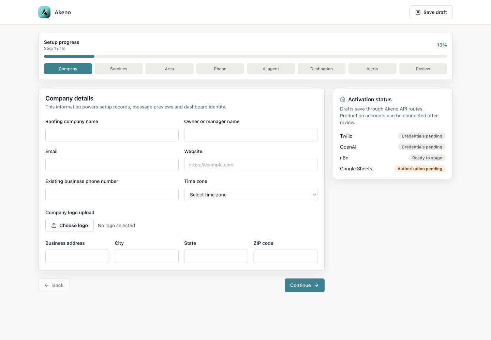
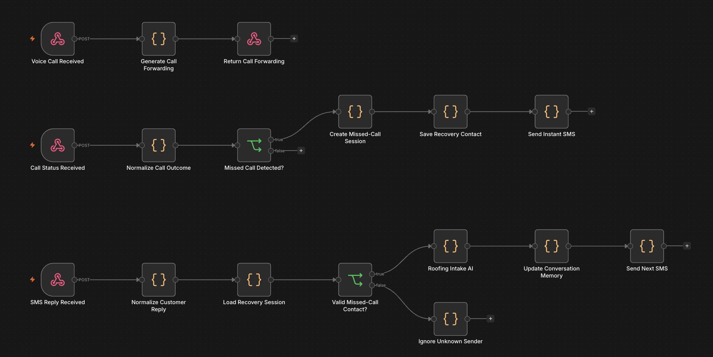

# Akeno

AI missed-call recovery platform for roofing and home-service businesses.

Akeno is a production-style SaaS prototype that shows how missed inbound calls can be converted into qualified leads through instant SMS follow-up, roofing-specific AI intake, urgent lead routing, owner alerts, and CRM or Google Sheets handoff. The project combines a polished client-facing web app with an n8n/Twilio/OpenAI workflow architecture.

## What This Demonstrates

- End-to-end product thinking across frontend, workflow automation, AI guardrails, and lead operations
- A real business use case with high-intent inbound leads, urgency detection, and human review
- Full-stack implementation discipline: typed schemas, Prisma models, local sandbox fallbacks, responsive UI, and QA checks
- Automation architecture that connects call/SMS events to lead creation, AI intake, conversation memory, and customer follow-up

## Product Context

Roofing companies often lose high-intent leads when office lines are busy, calls arrive after hours, or urgent storm/leak calls go to voicemail. Akeno models a recovery system that responds immediately, gathers structured job details, flags urgent water-intrusion scenarios, and prepares the lead for human review.

The core product boundary is intentionally human-in-the-loop: the AI can collect details and recommend next steps, but a roofing team confirms appointments, pricing, insurance claims, and safety-sensitive decisions.

## Web App Screenshots

<p>
  <strong>Homepage</strong><br />
  
</p>

<p>
  <strong>Operations dashboard</strong><br />
  
</p>

<p>
  <strong>Lead operations</strong><br />
  
</p>

<p>
  <strong>Integrations dashboard</strong><br />
  
</p>

<p>
  <strong>Onboarding workflow</strong><br />
  
</p>

## Automation Workflow

The workflow layer models how the product would operate behind the interface. Voice-call and SMS webhooks enter separate paths, missed calls are normalized into recoverable lead sessions, and valid customer replies continue through roofing-specific AI intake before the conversation memory is updated and the next SMS is sent.

<p>
  <strong>Missed-call recovery workflow</strong><br />
  
</p>

Key workflow paths:

- Voice call received: generates call forwarding and returns routing instructions
- Call status received: normalizes the outcome and detects whether the call was missed
- Missed call detected: creates a recovery session, stores the contact, and sends an instant SMS
- SMS reply received: loads the lead session, validates the sender, runs AI roofing intake, updates conversation memory, and sends the next message
- Unknown sender: exits safely without polluting lead memory

## Engineering Scope

- Responsive Next.js application with marketing, onboarding, dashboard, lead operations, integrations, privacy, contact, demo, and styleguide routes
- Client onboarding wizard with step validation, draft state, review summary, generated AI rules, and clean local sandbox behavior
- Lead operations table with search, status filters, urgency filters, sorting, empty state handling, and CSV export
- Lead detail drawer with conversation history, photo placeholders, urgency notes, recommended next action, and human confirmation boundary
- Dashboard views for recovered leads, reply rate, urgent lead volume, estimated recovered value, recent activity, and setup status
- Mobile navigation patterns for both public pages and authenticated-style dashboard views
- Akeno branding, favicon assets, responsive UI system, focus states, skip link, and reduced-motion support
- Playwright smoke tests covering public routes, onboarding, dashboard, leads, and mobile drawers
- Workflow automation design for missed-call detection, SMS recovery, AI intake, memory updates, and safe fallbacks

## System Design

```text
Missed roofing call
  -> Twilio-style webhook
  -> n8n workflow
  -> Roofing-only AI intake
  -> Lead record and conversation summary
  -> Urgent owner alert when needed
  -> CRM or Google Sheets handoff
  -> Dashboard review and human confirmation
```

## AI Workflow Design

The AI intake layer is designed around narrow, practical guardrails:

- Discuss accepted roofing work only
- Treat active leaks, water intrusion, storm damage, and tarp requests as urgent
- Ask for issue type, active water entry, property address, property type, roof age if known, insurance context, photos if available, and preferred appointment window
- Avoid structural safety diagnosis
- Avoid final price quotes
- Avoid promising insurance outcomes
- Capture appointment intent without automatically confirming service commitments

## Tech Stack

- Next.js App Router
- React and TypeScript
- Tailwind CSS
- Prisma ORM
- Postgres-ready schema for Neon or similar hosted databases
- Vercel deployment configuration
- Playwright end-to-end smoke tests
- n8n-oriented automation architecture
- Twilio-style SMS/call routing model
- OpenAI-style agent instructions
- Google Sheets/CRM handoff model

## Quality Signals

- Public repository excludes secrets, local databases, generated builds, Vercel metadata, and dependency folders
- Local sandbox mode provides demo data when no Postgres database is configured
- ESLint and production build scripts are configured
- Browser smoke tests cover the main portfolio/demo surfaces
- README screenshots come from the actual web app

## Technical Notes

```bash
npm install
npm run dev
npm run lint
npm run build
npm run test:e2e
```

The app runs locally on `http://localhost:3005`. Production-style persistence expects a Postgres `DATABASE_URL`; without one, the app intentionally uses sandbox data for portfolio/demo review.

## Production Hardening

This is a portfolio-grade prototype rather than a fully hardened multi-tenant SaaS. Before live client traffic, the next engineering steps would be:

- Real authentication and role-based access control
- Tenant isolation for multiple companies
- Twilio webhook signature validation
- Rate limiting on public API routes
- Production OpenAI logging and PII redaction
- Retry queues for SMS, CRM, and webhook failures
- Monitoring and error reporting
- Consent, opt-out, and messaging compliance workflows
- CI for lint, build, and end-to-end tests
